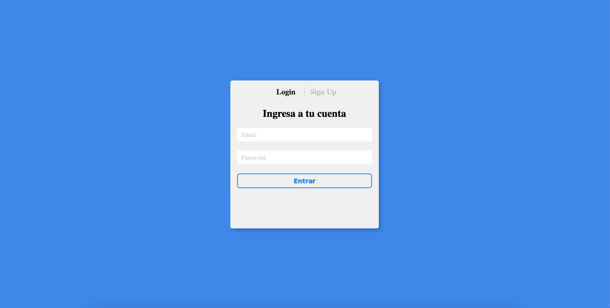
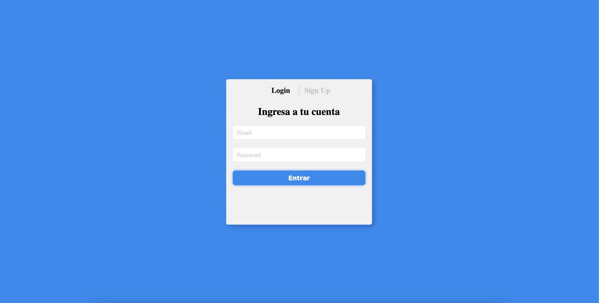
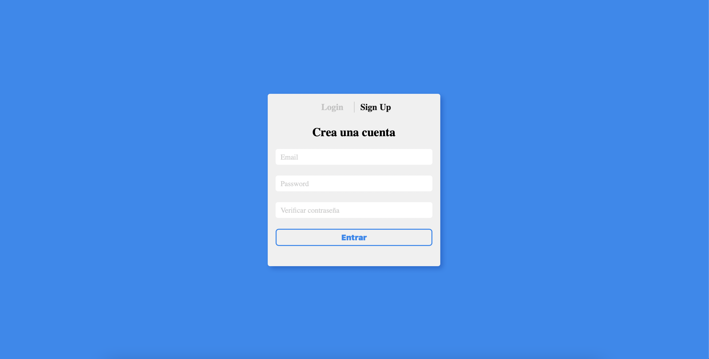
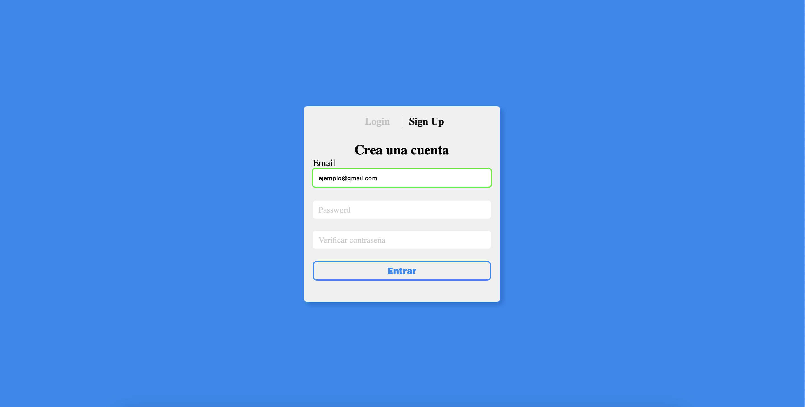
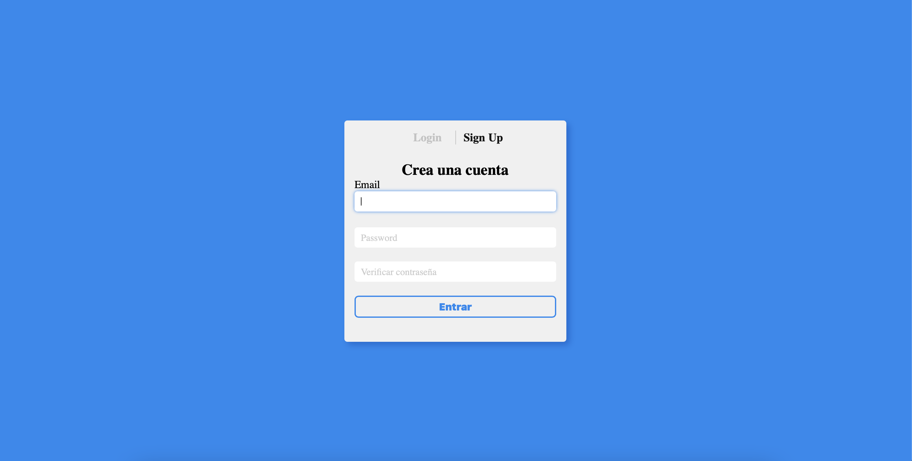
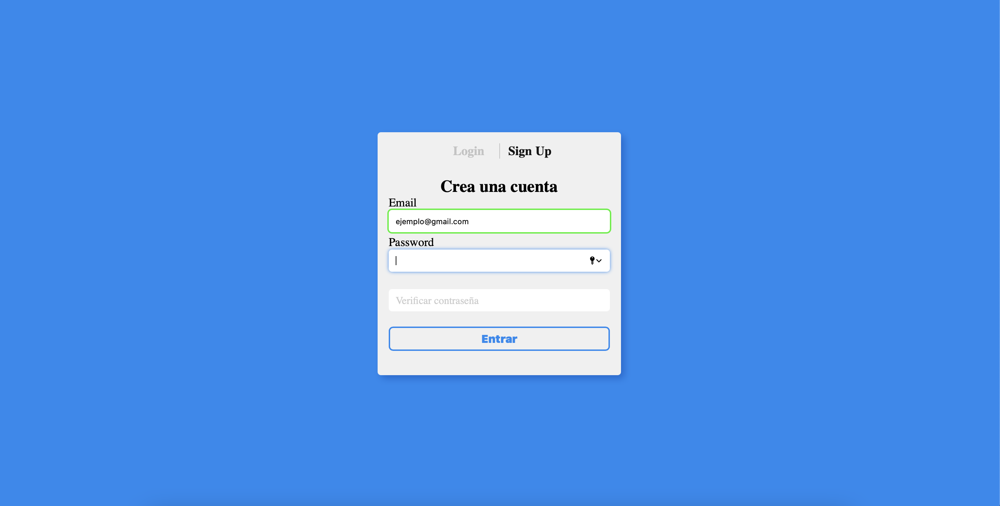
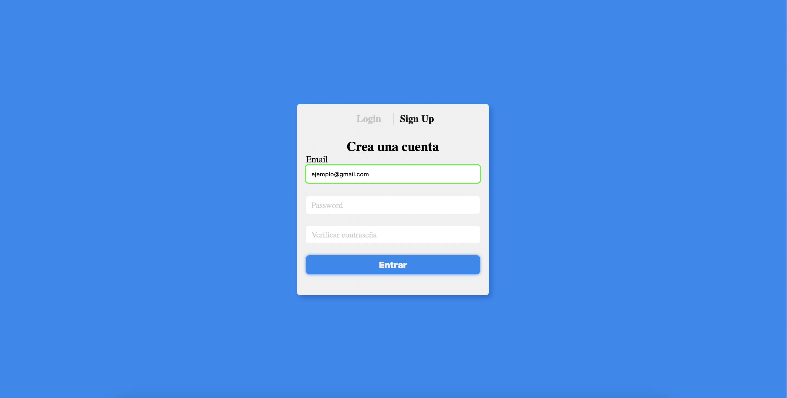

# Sample login page

## Login page with sections for login and signup

The functionality is powered only by HTML and CSS, using position relative and absolute, display flex, links and using the pseudoclass "target" for displaying or hidding elements depending on the url 

## Here´s some screenshots 

- 
Login form

    
- 
Login form with button hover

    
- 
Signup form

    
- 
Signup form with input filled

    
- 
Signup form with input focus

    
- 
Signup form with input filled and input focus

    
- 
Signup form with input filled and button hover

    
